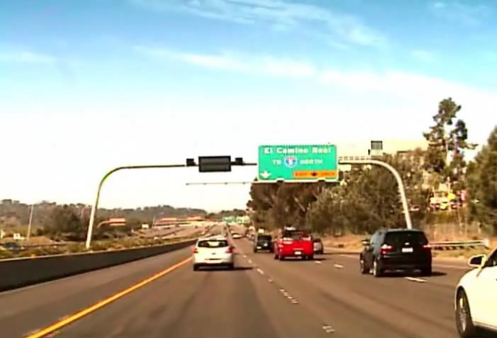

# ROI_vehicle_detection
Region Of Interest for automated vehicle detection in a highway.
Project for Digital Image Processing subject, Electrical and Computer Engineering department, University of Patras.
08 July 2019

# Prerequisites

Matlab 2017.

# Code

The main code is in the file code/Project.m and this is the one we need to execute. First, we need to put the original video 'april21.avi' in the same folder with Project.m or specify the path.

All the other files contain the techniques used to assist us with the task of defining a Region Of Interest in the video that is given to us.

# Information

**Input video**
Read the video 'april21.avi'. This video contains information of 24 bits per pixel. The duration of the film is 10 seconds and FPS is 30. So, we have a total of 300 frames
and each frame is an RGB image of dimensions 480x704x3.

This is a Moving Camera Moving Objects (MCMO) video, which is the hardest situation to analyze in a dynamic scene.

*First frame of the video*

