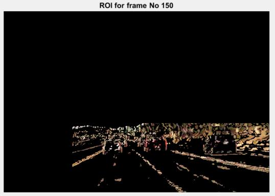

# ROI_vehicle_detection
Region Of Interest for automated vehicle detection in a highway.
Project for Digital Image Processing subject, Electrical and Computer Engineering department, University of Patras.
08 July 2019

# Prerequisites

Matlab 2017.

# Code

The main code is in the file code/Project.m and this is the one we need to execute. First, we need to put the original video 'april21.avi' in the same folder with Project.m or specify the path.

All the other files contain the techniques used to assist us with the task of defining a Region Of Interest in the video that is given to us.

# Report

## Input video
Read the video 'april21.avi'. This video contains information of 24 bits per pixel. The duration of the film is 10 seconds and FPS is 30. So, we have a total of 300 frames
and each frame is an RGB image of dimensions 480x704x3.

This is a Moving Camera Moving Objects (MCMO) video, which is the hardest situation to analyze in a dynamic scene.

This is the first frame of the video:

## Methods for defining ROI
We define the Region Of Interest for this video as the region in which will appear only the cars.

There are many different methods for this to happen. The three main categories are these:
1) frame differencing
2) background update
3) virtual loop

In this project I use a method from the 1st and a method from the 2nd category.

## First method: Inter-frame Difference Method

Convert RGB image to Grayscale. 

Then calculate for each pixel the absolute difference between the current value and the value of the next frame. 

If this value is greater than a threshold, T, that we define then there is possibly a moving object in this region.

So, we create a binary map where the value of the pixels are equal to 1 if there is a moving object in this position, or an environment with varying brightness and 0 if there isn't.

After experimenting with different values for the threshold, I chose the value T=2.

If I work with a mask 4x4 and I calulate the sum of the absolute differences the results are even better. For this case I set the value of threshold, T=8.

One more way to avoid choosing an unwanted region is to see the video and define the area in which I want to run this algorithm. So I can set an offset for the values (x,y) of the image by watching the first and the last frame of the video. The region I end up with is the following: [298:480, 183:704].

For this process I built the function FrameDifferencingMask.m which works with blocks of pixels 4x4.

This is the 50th frame for the Inter-frame Difference Method block by block:

I also built the function FrameDifferencing.m which works pixel by pixel.

This is the 50th frame for the Inter-frame Difference Method pixel by pixel:

The advantage of this technique is not the precision, but the low computing cost.

I also export the video with the name FrameDifferencing.avi when the code is executed.

## Second method: Frame Average Method

With this method I aim to detect the background and then substract it from each frame in order to remain with the ROI.

Convert RGB image to Grayscale. 

I calculate the average value of each pixel for 5 frames (succesively). Then I calculate the absolute difference between the value of a pixel and the average value calculated. I create a binary mask where if this value of the absolute difference is greater than a threshold, then the corresponding pixel takes the value of 1 or else the pixel takes the value of 0.

After some experimentation I choose the value T=10 for the threshold.

In this method too, to minimize the area of work I choose the region [298:480, 183:704].

For this method the function FramesAverage.m is built.

This is the 50th frame for the Frame Average Method:

We can observe that ROI is mainly consisted of vehicles' contour and is smaller comparatively to the 1st method. 

The main disadvantage of this method is the inadequacy to detect stationary or low velocity vehicles.

I also export the video with the name FramesAverage.avi when the code is executed.

## Create Noise 

In this project we were called to create 2 different kinds of noise  e.g. Gaussian and Salt & Pepper and then use denoising techniques.

### Gaussian noise

First, I generate **Gaussian** noise of mean value = 0 and variance = 5500. 

These are the 1st and 150th frames before and after applying AWGN:

Afterwards, I apply the **Inter-frame Difference Method** pixel by pixel.

This is the 150th frame for the Inter-frame Difference Method pixel by pixel with AWGN:

We can observe an expansion of the ROI, which is unwanted. This is due to the presence of the noise. To tackle this problem we can increase the value of the threshold from T=2 to T=7.

This is the result:

This ROI tends to look like the original with T=2 and without the noise.

Now, I apply the **Frame Average Method** with theshold T=10.

This is the 150th frame for the Frame Average Method with AWGN:

For this method the results are similar whith these without the noise, so we keep the threshold value at T=10.

### Impulse noise

The second kind of noise I create is **impulse** noise or **salt & pepper** noise. in a percentage p%. I choose this value to be p=20.

For this noise i created the function SaltAndPepper.m and the results are presented for the 1st and 150th frames before and after applying the impulse noise:

Afterwards, I apply the **Inter-frame Difference Method** pixel by pixel.

This is the 150th frame for the Inter-frame Difference Method pixel by pixel with impulse noise:

The ROI is altered too much and the threshold value doesn't make it better.

Now, I apply the **Frame Average Method** with theshold T=10.

This is the 150th frame for the Frame Average Method with impulse noise:

In this case, also, the results are bad and can't be fixed by changing the threshold value. 

Therefore, salt & pepper can't be treated with any of the two methods that I used for the definiton of ROI.

## Removal of the Noise

### Gaussian noise

For the **Gaussian** noise I apply a **moving average filter**. This is a lowpass (LP) FIR (Finite Impulse Response) filter and it is very efficient at eliminating AWGN (Additive White Gaussian Noise).

A disadvantage of such filters is that they limit the high frequency information of the video i.e. contours and that reduces the image quality of the frames.

I chose to work with a mask 3x3. I calculate the average value of the pixels and replace their original value with their average value. For the limits of the frames I use zero padding technique.

For this filter I wrote the function MovingAverageFilter.m and the results for the 1st and the 150th frame before (with AWGN) and after the application of the filter can be seen here:

We can see the improvement in the video quality. I also wrote the function MeanSquareError.m to calculate the MSE between two frames. So the MSE of the 1st frame before and after the filter usage is this (the lower the better):

Now I apply the **Inter-frame Difference Method** pixel by pixel.

This is the 150th frame for the Inter-frame Difference Method pixel by pixel with AWGN after the application of moving average filter:

The result is satisfying. It is better compared to the ROI with AWGN, so we keep the value of the threshold at T=2.

I also use the **Frame Average Method** with theshold T=10.

This is the 150th frame for the Frame Average Method with AWGN after the application of moving average filter:

Comparing the ROI with the original we see that it is smaller. Therefore I decrease the value of threshold to T=7.

### Impulse noise

For the **Impulse** noise I apply a **median filter**. This is a linear lowpass (LP) filter and it is very efficient at eliminating AWGN (Additive White Gaussian Noise), while also keeping intact the contours in the frames.

I work with a mask 3x3 and the value of each pixel is replaced by the median value that results from sorting the pixels' values at the area of the mask. For the limits of the frames I use zero padding technique.

For this filter I wrote the function MedianFilter.m and the results for the 1st and the 150th frame before (with impulse noise) and after the application of the filter can be seen here:

The quality of the frames is greatly improved. The MSE was calculated for this case too, for the 1st frame before and after the use of the median filter (the lower the better):

Now I apply the **Inter-frame Difference Method** pixel by pixel.

This is the 150th frame for the Inter-frame Difference Method pixel by pixel with impulse noise after the application of median filter:

The results are good, but we could increase the threshold value from T=2 to T=5 to have a smaller ROI:

I also use the **Frame Average Method** with theshold T=10.

This is the 150th frame for the Frame Average Method with impulse noise after the application of medina filter:

The result is satisfying so we keep the value of the threshold T=10.

## Create a Vehicle Detection Mask

The methods for vehicle detection can be divided in three main categories:
1) knowledge-based
2) motion-based
3) wavelet-based

Here, I focus on the 1st category. I try to exploit knowledge like the color of the cars, the edges, the shadows etc.

### Edge Detection

At first, I apply the Sobel mask to the frames in order to detect the edges in the ROI. The detection of edges with Sobel mask is an operator for local use. The dimensions of the mask here are 3x3.

I built the function EdgeDetectionSobel.m for this purpose. I also wrote the function EdgeDetectionThreshold.m in order to choose a threshold for which I keep the pixels selected by the Sobel mask, or not.

A good technique to calculate the value of the threshold would be through the histogram of each frame. But, since we have 300 frames this would be very time and energy consuming. Therefore, I chose a simpler method after finding the minimum and maximum value of each frame's pixels.

threshold = c * (max - min) + min

By giving appropriate values at the constant c I can control the value of the threshold and therefore the percentage of pixels that are over the threshold. 

For the **Inter-frame Difference Method** I chose the value c=0.55 and I found that I keep in average (from the 300 frames) 6.58% of the pixels. These are the results for the 50th frame:

And this is the Sobel mask for the 50th frame:

I do the same process for the **Frame Average Method** with the value of the constant c=0.55 and I keeip in average (from the 300 frames) 22.5% of the pixels. These are the results for the 50th frame:

And this is the Sobel mask for the 50th frame:

### Color Detection

I observe the original video and I notice that the only red object in the image is the red vehicle. So, I want to keep every red pixel values in the ROI. This is also true for the two black vehicles.

Each color is reperesented by certain values in the RGB space.

I built the function ColorDetection.m for this puprpose.

